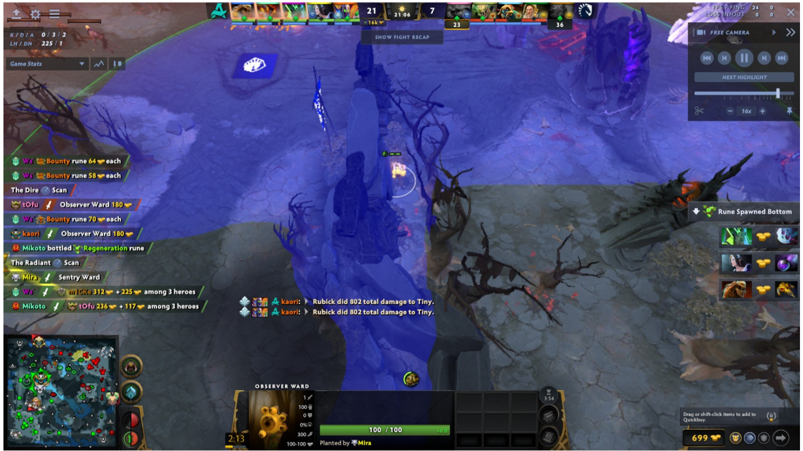
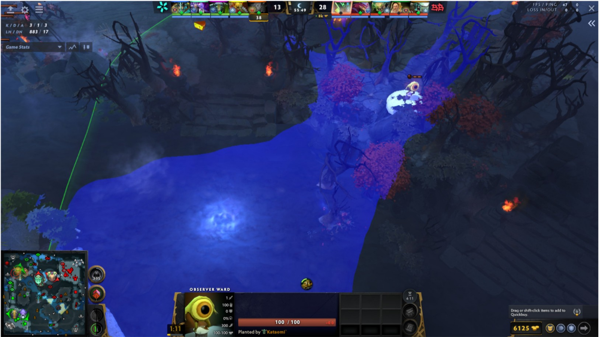
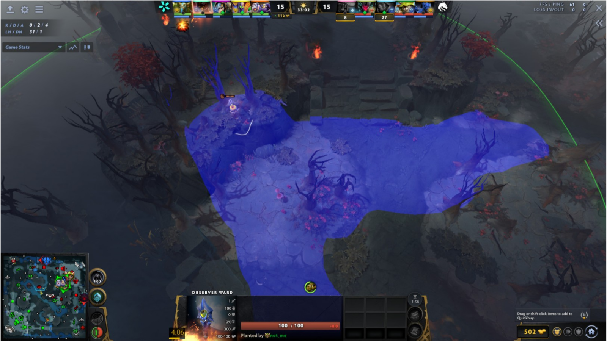
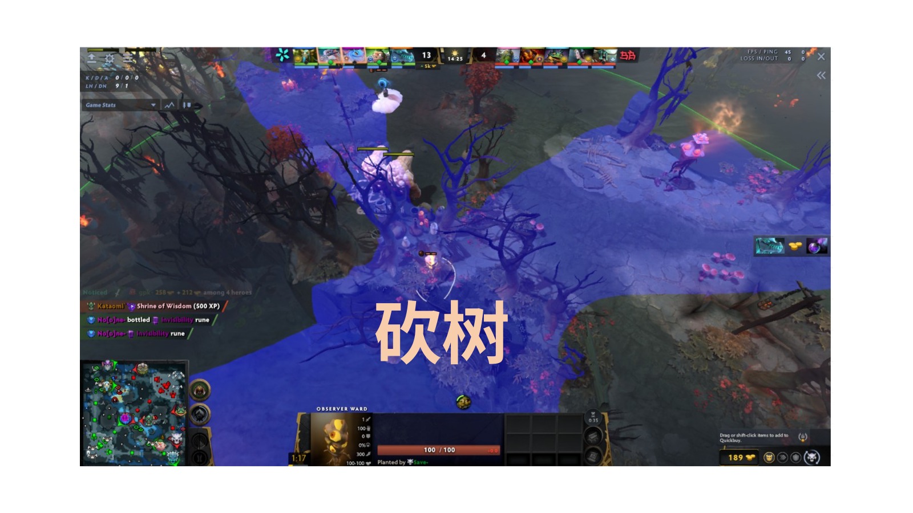
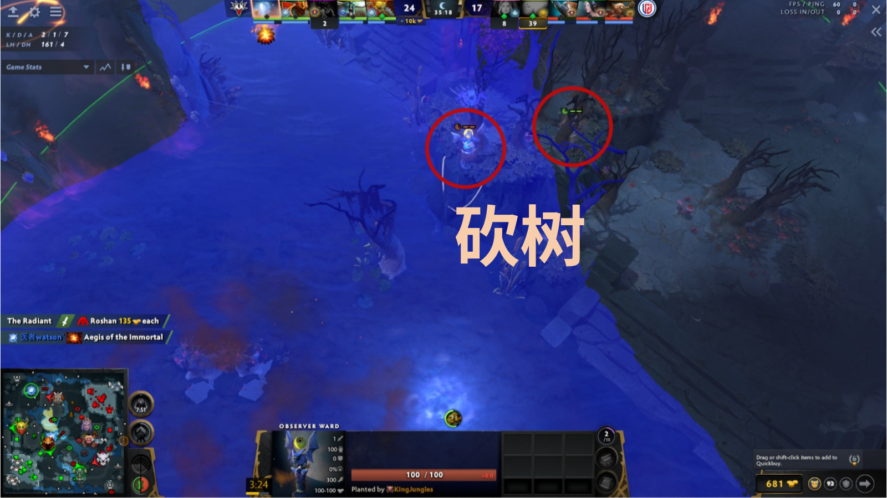
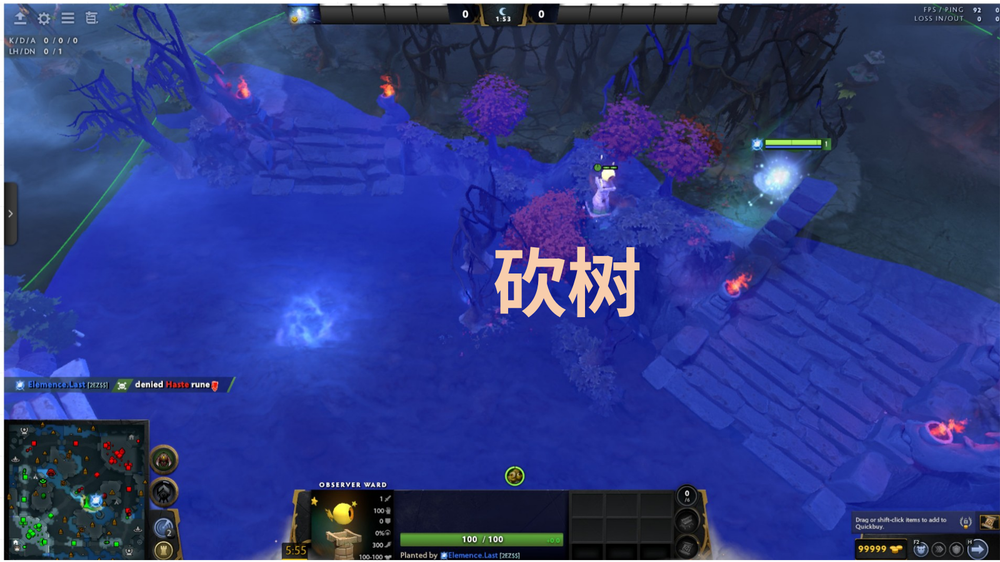

# 夜魇防守眼

原 PPT 第 24–32 页。重点是基地入口、夜魇侧河道与需要砍树的隐蔽防守点。

## 第 25 页 — 基地高地入口窄缝眼

- 观察：从防守视角监控基地高地入口、坡道和外侧主路，可提前看到正面推进。
- 注意：中央石柱制造明显盲区，需要英雄或第二个眼位补足侧翼。

## 第 26 页 — 河道坡口树林眼

- 观察：眼位贴近树林与悬崖，视野从高地延伸至河道和对岸坡口。
- 注意：落点较隐蔽，但视野主要偏向河面，身后野区仍需额外预警。

## 第 27 页 — 野区台阶高台眼

- 观察：覆盖台阶、高地平台和左右两条野区路线，适合保护腹地。
- 注意：高台中央是较直观的反眼位置；可根据敌方真眼习惯调整插眼时机。

## 第 28 页 — 符点与河道交叉口眼

- 观察：覆盖河道符点、石碑和多条上坡路线，可监控敌方进野或转向目标区。
- 注意：河道侧视野宽，树林后的纵深较弱。

## 第 29 页 — 砍树：智慧神符侧入口

- 原图标注：砍树。
- 观察：砍树后可从高台观察智慧神符侧道路、坡道和周边野区入口。
- 注意：该页与第 22 页画面相同，但在原 PPT 中用于夜魇防守语境。

## 第 30 页 — 砍树：野区高台

- 原图标注：砍树。
- 观察：移除树木后，眼位连接营地、高地和侧向道路的视野。
- 注意：该页与第 23 页画面相同；防守时重点是识别敌方深入野区的路线。

## 第 31 页 — 砍树：双位置对照

- 原图标注：砍树；画面用两个红圈标出相关位置。
- 观察：左侧是主要眼位，右侧标出树林内的辅助位置 / 路径；砍树可打开二者之间及通向河道的视线。
- 注意：实战应先确认要保留的藏眼树木，避免过度砍伐反而让眼位更易被发现。

## 第 32 页 — 砍树：河道桥头树林眼

- 原图标注：砍树。
- 观察：眼位位于桥头与树林交界，砍树后可覆盖河面、台阶和相邻高地入口。
- 注意：桥头是高频交战与排眼区域，眼位寿命通常取决于布置时机。
