# 夜魇进攻眼

原 PPT 第 33–50 页。重点是深入天辉野区、河道和大型目标区时的进攻视野。

## 第 34 页 — 天辉野区三岔路口眼

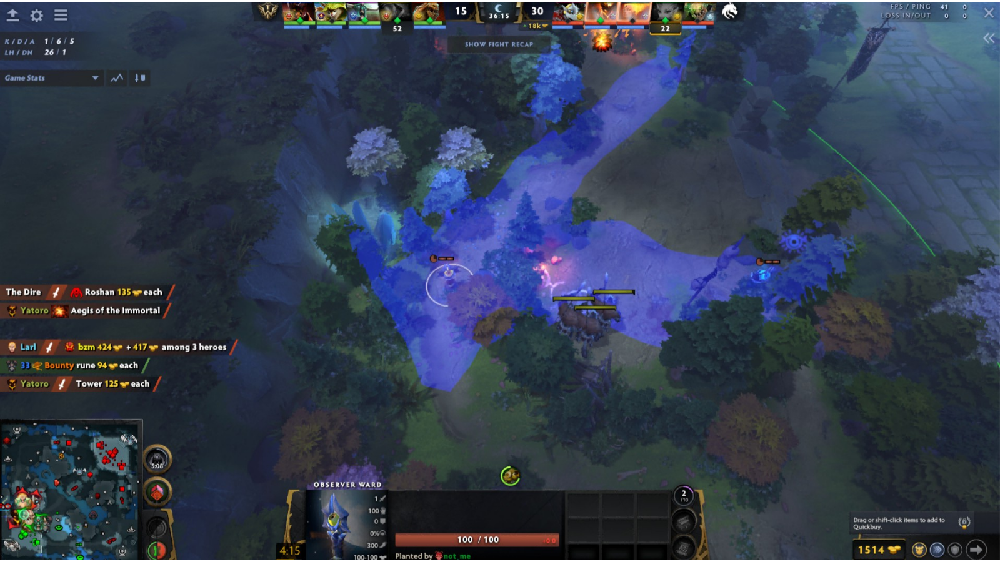

- 观察：覆盖中立生物营地、通往边线的长路和高地入口，适合进攻方判断支援方向。
- 注意：视野被树林分成数条通道，单位可能在树后短暂消失。

## 第 35 页 — 基地侧长廊眼

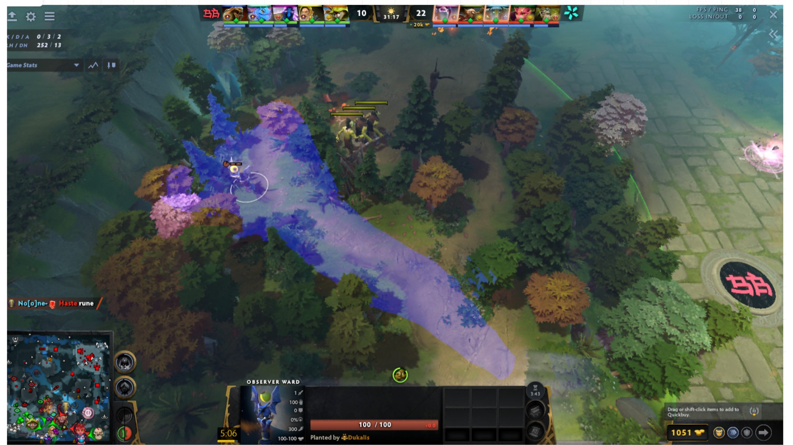

- 观察：视野沿林间长廊延伸，适合发现从基地或边线进入野区的英雄。
- 注意：横向覆盖很窄，应与路口眼或高台眼组合使用。

## 第 36 页 — 石桥与符点入口眼

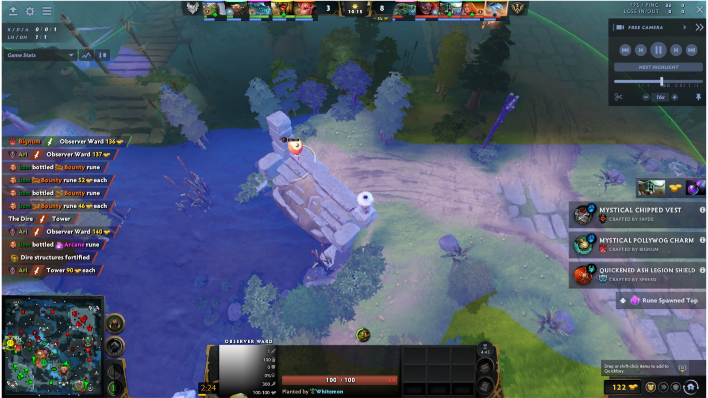

- 观察：利用桥头高差观察河道、符区和天辉侧上坡入口。
- 注意：该页与第 4 页画面相同，在本章作为夜魇进攻路线参考。

## 第 37 页 — 天辉野区三岔眼

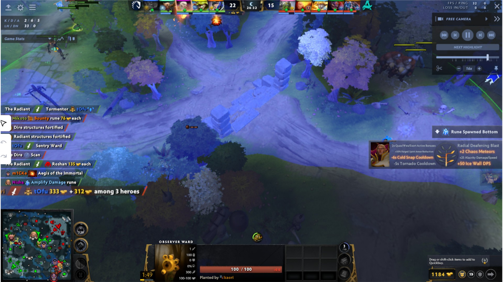

- 观察：覆盖野区主路、桥边与目标区入口，适合入侵和阻断撤退。
- 注意：该页与第 5 页画面相同；进攻方更应关注天辉从基地侧回防的路径。

## 第 38 页 — 中路高地下方三岔眼

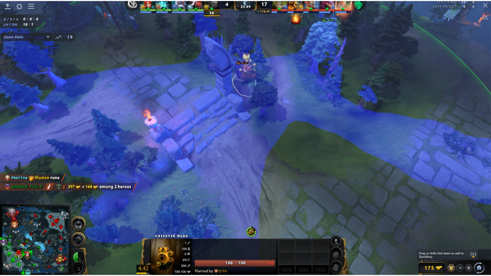

- 观察：以石柱旁高地为中心，连接中路、野区入口和侧向道路的视野。
- 注意：属于明显高点，信息量与反眼风险都较高。

## 第 39 页 — 中路树丛穿透眼

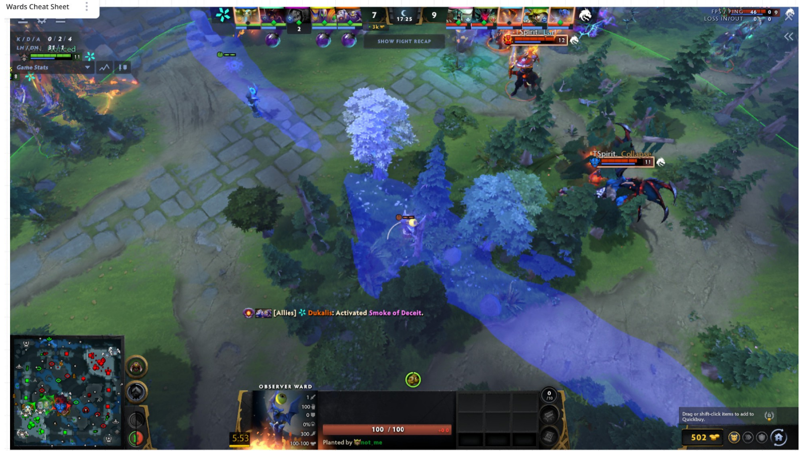

- 观察：眼位藏于中路旁树丛，形成通往中路和野区的两条狭长视野带。
- 注意：隐藏性优于标准高台眼，但覆盖范围不完整，适合针对特定回防路线。

## 第 40 页 — 河道高台树林眼

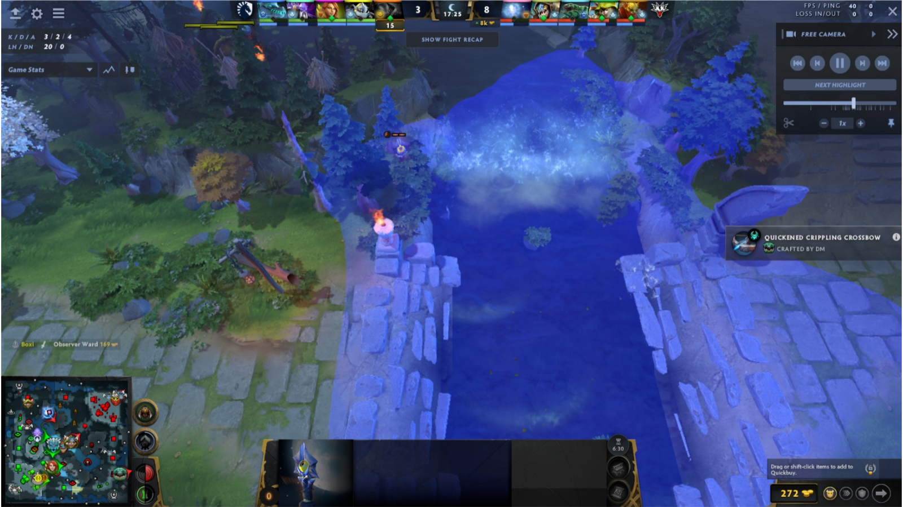

- 观察：从树林高台覆盖河道纵深和桥头，适合目标争夺前获取先手信息。
- 注意：两侧高地和树木形成大块盲区。

## 第 41 页 — 河道边缘树眼

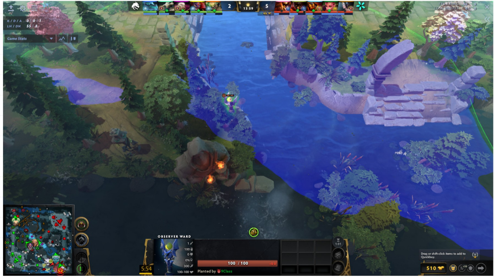

- 观察：眼位贴近河岸树林，主要观察河心、桥头与一侧坡道。
- 注意：背向树林的一侧覆盖有限；需要根据进攻方向决定是否值得投入。

## 第 42 页 — 大型目标区外侧深树眼

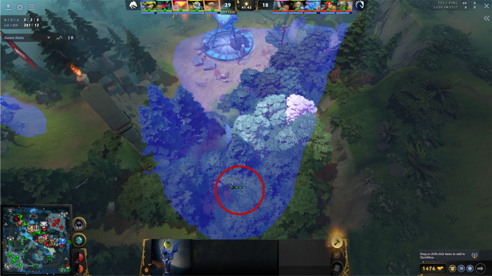

- 观察：红圈标出深藏在树林内的眼位，可观察上方大型建筑 / 目标区与一条接近路线。
- 注意：视野呈窄扇形，优势是隐蔽而不是覆盖面；地图版本变化后需重新确认树位。

## 第 43 页 — 痛苦魔方通道眼

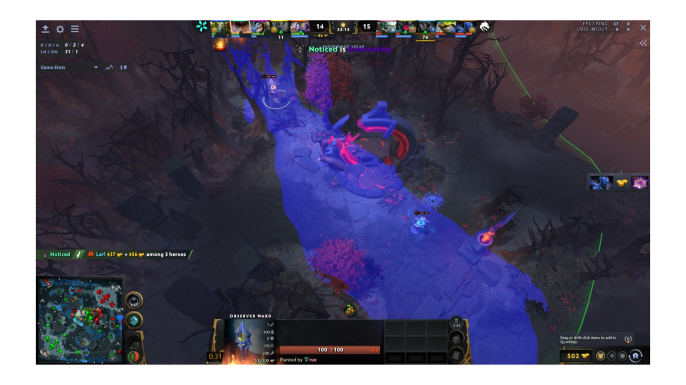

- 观察：视野贯穿痛苦魔方周边主路，上下各有一个相关眼位，可监控目标与回防通道。
- 注意：打痛苦魔方前后是高频排眼时段，建议与烟雾或推进节奏配合布置。

## 第 44 页 — 河道符点眼

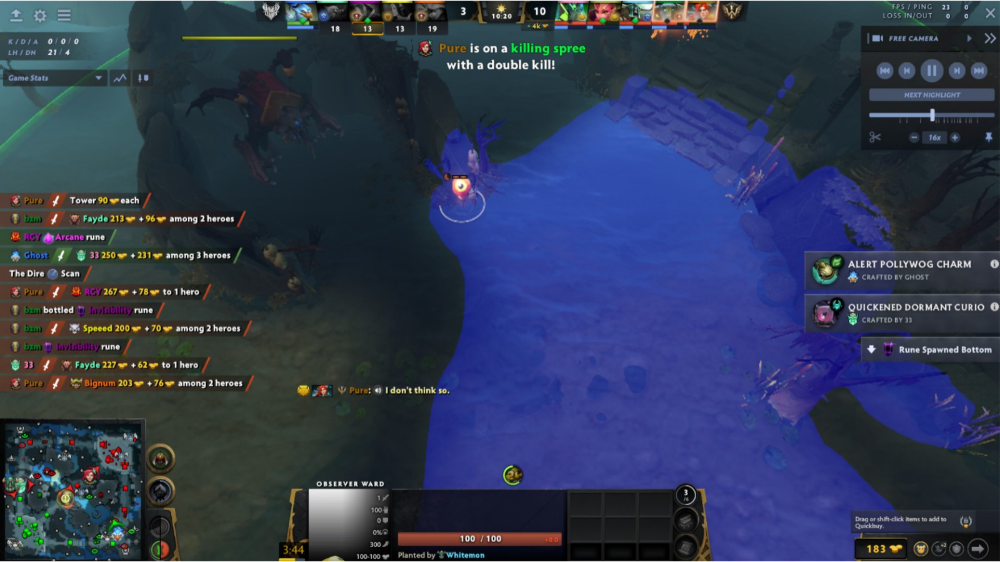

- 观察：覆盖河心、符点和两侧坡道，对控符、抓人和进入敌方野区都有直接价值。
- 注意：落点处于常见河道高台，通常需要先排除敌方真眼。

## 第 45 页 — 大型目标区河道眼

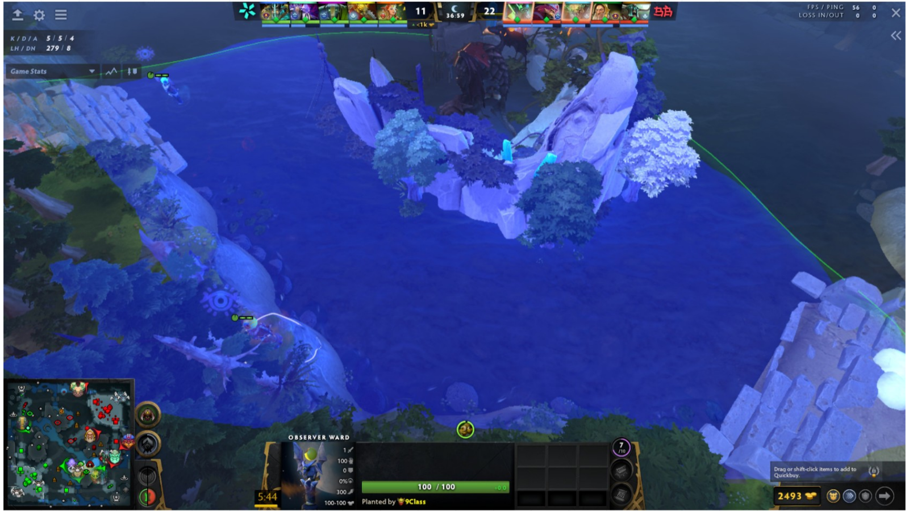

- 观察：覆盖大型目标区外侧河道、两边桥头和树林出口，适合判断敌方是否靠近目标。
- 注意：中央大型地形完全遮挡另一侧，不能把蓝色范围理解为完整圆形视野。

## 第 46 页 — 目标区对岸高台眼

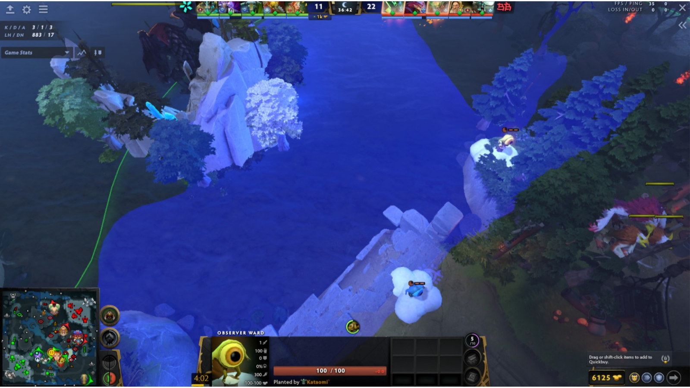

- 观察：从对岸高台覆盖河道中央、桥头和目标区外缘；画面也展示了附近其他眼位作为对照。
- 注意：多个常见落点相距较近，敌方一次真眼可能同时检查多个位置。

## 第 47 页 — 目标区河道全景眼

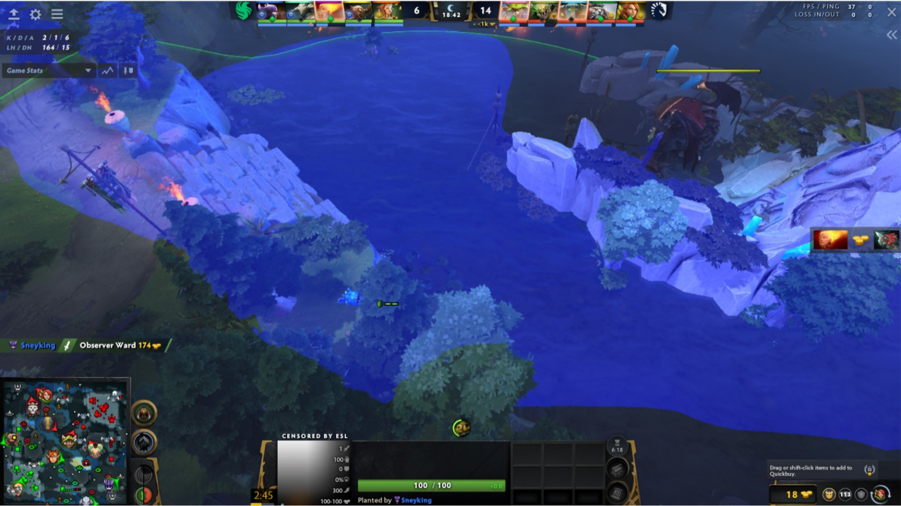

- 观察：视野横跨较长河段、桥头和目标区入口，适合围绕大型目标组织推进。
- 注意：图中眼位贴近下方树林；河道另一端仍会被高地切断。

## 第 48 页 — 河道高台全景眼

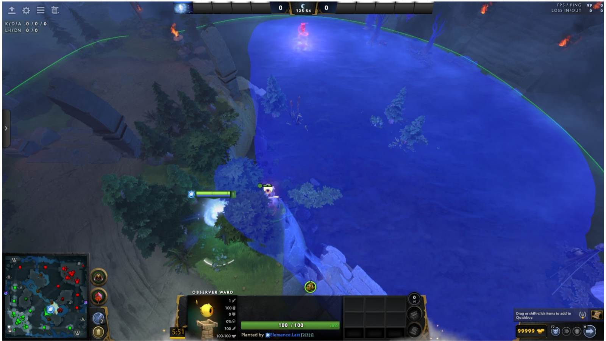

- 观察：高台眼提供接近半圆形的河道大范围视野，可看到对岸眼位与主要通道。
- 注意：覆盖面很大，也意味着该高台通常是优先排查位置。

## 第 49 页 — 砍树：目标区桥头眼

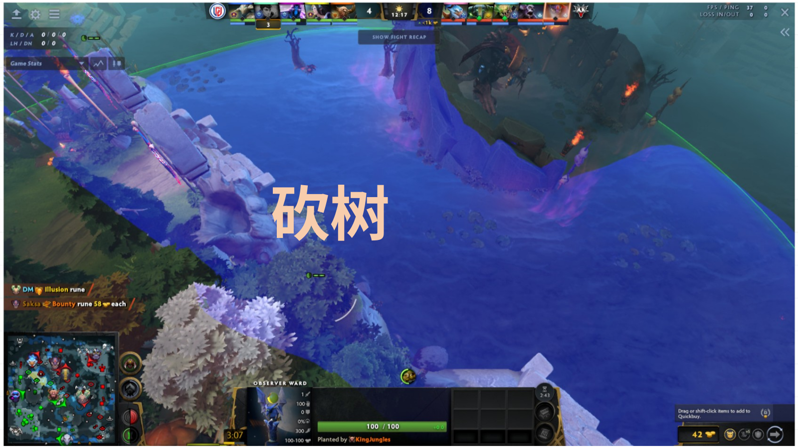

- 原图标注：砍树。
- 观察：砍掉眼位附近树木后，可连通桥头、目标区外侧河道和天辉侧入口的视野。
- 注意：清理树木会让落点更易被肉眼识别，应权衡视野收益与隐藏性。

## 第 50 页 — 砍树：河道桥头树林眼

- 原图标注：砍树。
- 观察：眼位位于夜魇侧桥头树林，砍树后覆盖河面、台阶与高地入口。
- 注意：该页与第 32 页画面相同，但在原 PPT 中用于夜魇进攻章节的收尾对照。
