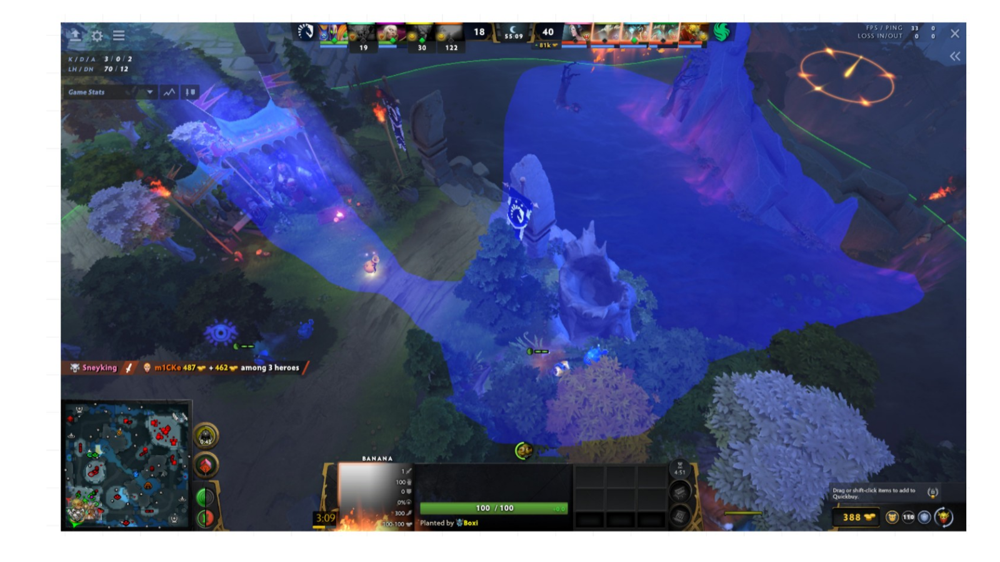
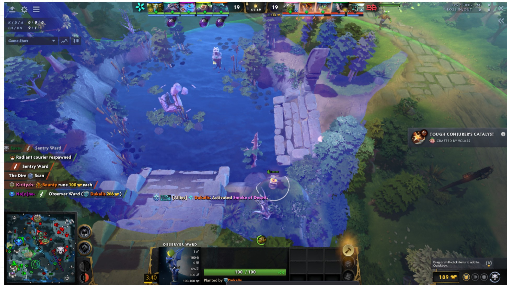
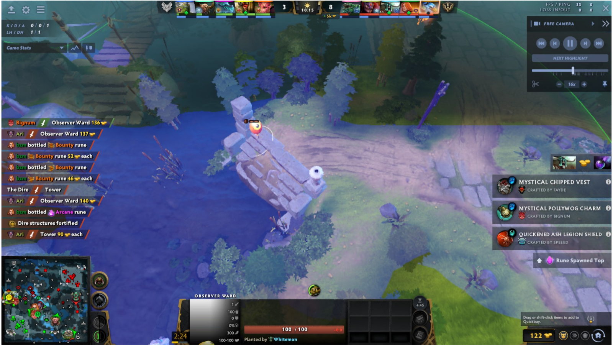
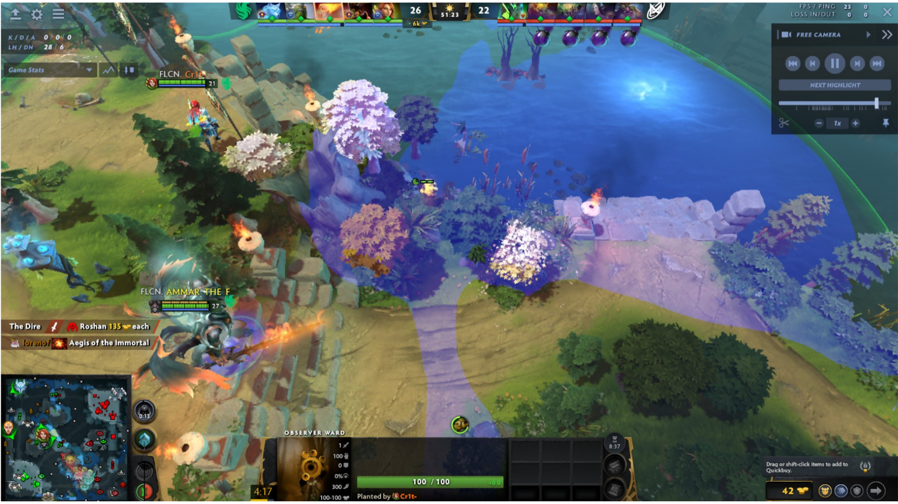
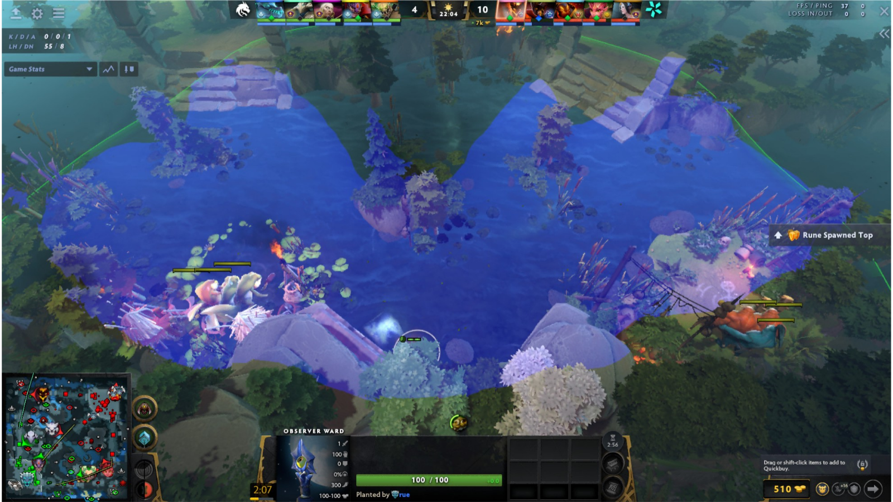
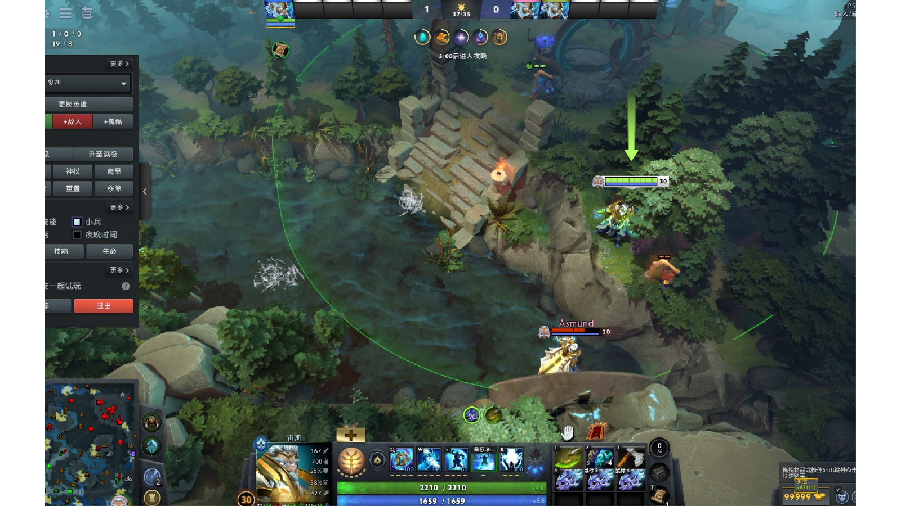

# 天辉防守眼

原 PPT 第 1–10 页。重点是河道入口、坡道、野区交叉口和基地侧通道的预警视野。

## 第 2 页 — 坡道外侧树林眼

- 观察：眼位贴近树林与坡道边缘，视野同时延伸到河道、坡口和基地侧通道。
- 注意：高台与密林会切掉部分边缘视野；该点更适合提前发现沿河或上坡的推进。

## 第 3 页 — 河道岔口眼

- 观察：覆盖河道转角、两侧台阶和相邻树林出口，可同时监控多条接近路线。
- 注意：落点靠近通行区域，虽然信息量大，也较容易落入常规反眼范围。

## 第 4 页 — 石桥与符点入口眼

- 观察：借助石桥边缘高差，监控河道、桥头与上坡入口。
- 注意：树林后的侧翼区域不可见；适合看主要通道，不适合单独承担野区深处预警。

## 第 5 页 — 野区三岔路口眼

- 观察：覆盖桥边、野区主路和通往边线的岔口，对追踪转线较有价值。
- 注意：这是高频通行区，插眼路径和眼位本身都更容易被看到。

## 第 6 页 — 河道口高台眼

- 观察：从高台向河面和桥头展开扇形视野，可提前看到跨河或转入野区的单位。
- 注意：靠树林一侧存在遮挡，防守时仍需结合英雄站位覆盖死角。

## 第 7 页 — 河道高台树林眼

- 观察：眼位藏在河岸树林边缘，主要覆盖河道纵深与两端入口。
- 注意：隐藏性较好，但高台本身是常见侦查目标，关键团战前应预判真眼范围。

## 第 8 页 — 河区双坡眼

- 观察：视野横跨河区，能同时看到两侧坡道、河心和附近目标区入口。
- 注意：价值集中在河道控制；两侧树林深处仍是明显盲区。

## 第 9 页 — 边缘树林隐藏眼

- 观察：落点位于台阶旁的树林 / 高地边缘，利用地形隐藏眼位并观察河道侧动向。
- 注意：画面用绿色箭头强调接近位置；实战应确认当前版本的可达路径和树木分布。

## 第 10 页 — 砍树：高台入口眼

- 原图标注：砍树。
- 观察：移除中央树木后，眼位可连接高台入口、河道和基地侧路径的视野。
- 注意：砍树动作会暴露意图，且地图树木刷新后需要重新确认路径。
