# 天辉进攻眼

原 PPT 第 11–23 页。重点是深入夜魇野区、河道目标区和基地外侧通道时的进攻信息。

## 第 12 页 — 敌方野区外侧河口眼

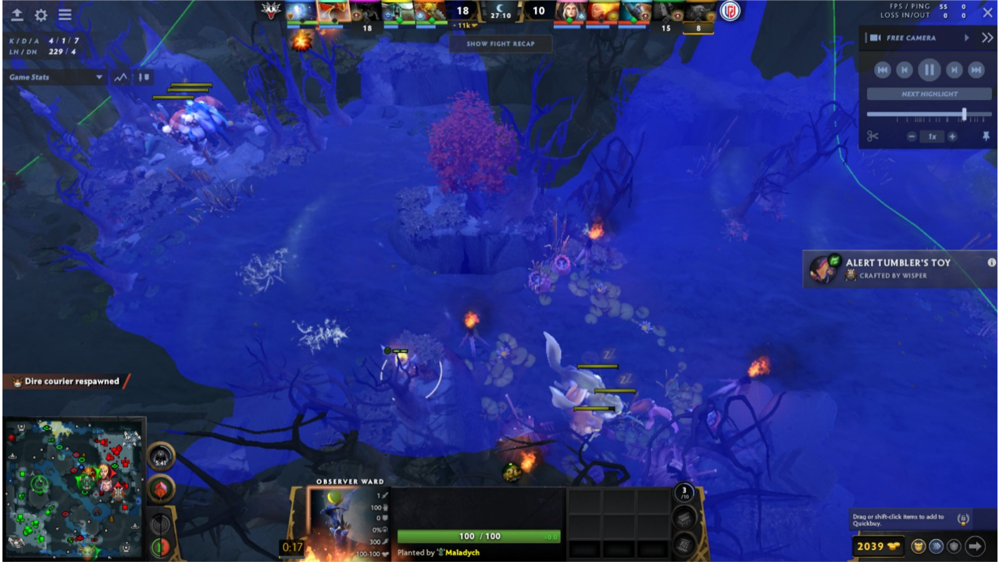

- 观察：视野覆盖河口、两片野区入口和附近中立生物区域，适合捕捉敌方回防路线。
- 注意：覆盖面大但落点靠近主路，压进前应先排除常规真眼。

## 第 13 页 — 敌方野区高台眼

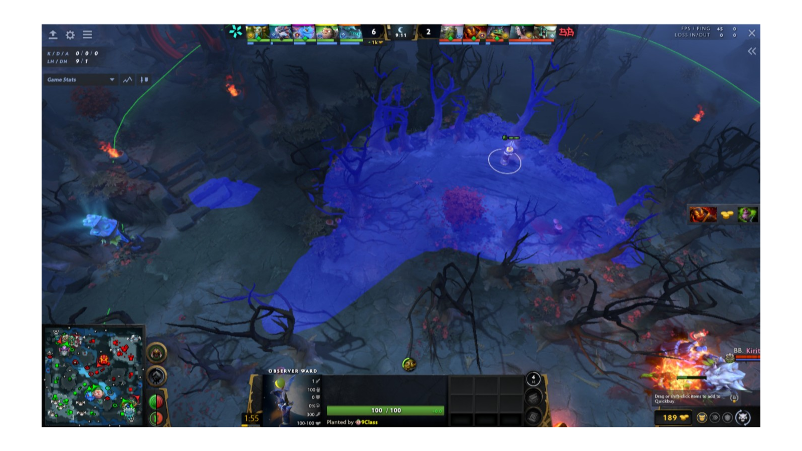

- 观察：放在林间高台中央，主要观察野区腹地与通向河道的出口。
- 注意：周围树木造成不规则边界；重点价值是高地预警，而非完整覆盖所有营地。

## 第 14 页 — 野区营地侧高台眼

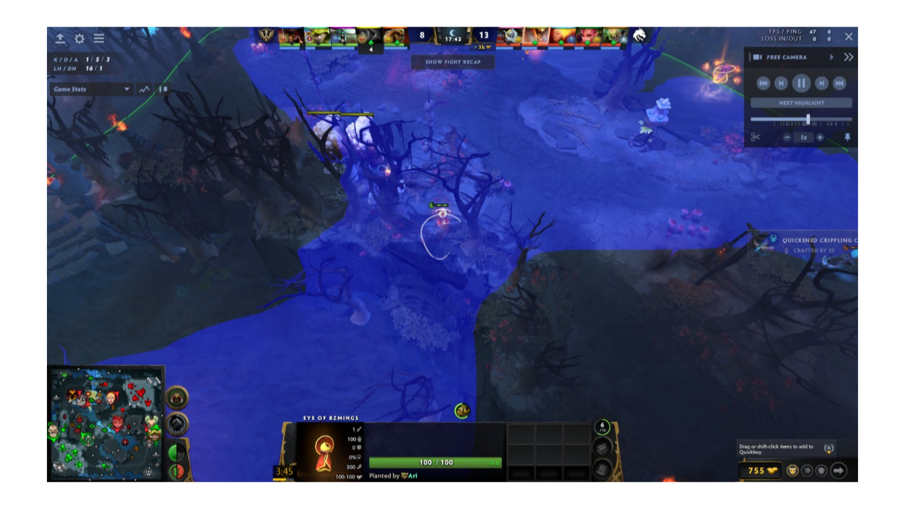

- 观察：覆盖中立生物区域、上下坡和一条向基地延伸的通道。
- 注意：眼位所在高台较显眼，适合进攻窗口期使用，不宜预期长期存活。

## 第 15 页 — 基地侧坡道眼

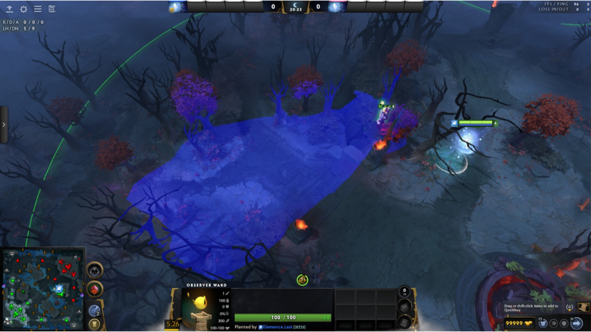

- 观察：狭长视野沿坡道展开，可发现从基地侧进入野区的英雄。
- 注意：横向视野被树林限制，最好与另一侧眼位形成交叉覆盖。

## 第 16 页 — 敌方高地营地眼

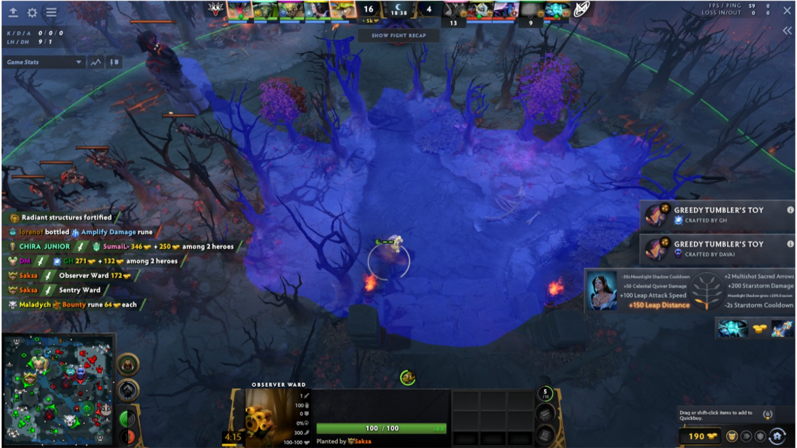

- 观察：覆盖高地平台、营地和多条进出路线，适合入侵、控野和判断回防人数。
- 注意：属于信息量很高的常规高台，反眼概率也高。

## 第 17 页 — 野区十字路口眼

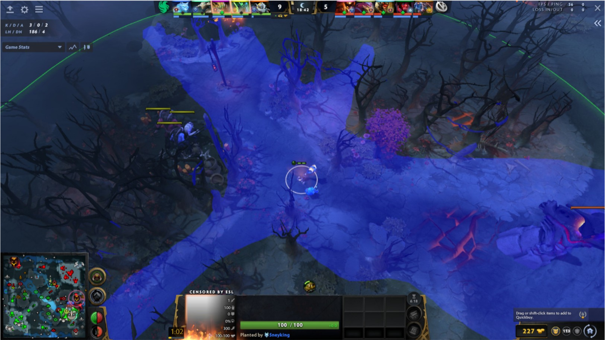

- 观察：以路口为中心向三条方向延伸，适合追踪敌方从基地、边线与河道之间的移动。
- 注意：图中树木切出多个细长视野通道，单位可能短暂进入盲区。

## 第 18 页 — 东北前哨入口眼

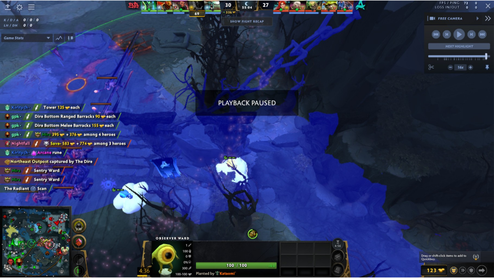

- 观察：根据画面事件提示，该点位于东北前哨区域，覆盖前哨、坡道和基地侧入口。
- 注意：目标争夺时双方通常都会带真眼，眼位更适合配合即时推进。

## 第 19 页 — 骨架地标旁高台眼

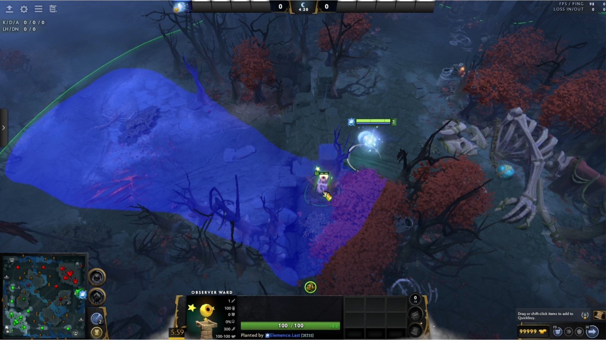

- 观察：可用大型骨架地标定位，视野沿高台边缘覆盖一条主要通道。
- 注意：覆盖偏单侧，另一侧树林和高差后的区域仍不可见。

## 第 20 页 — 河道符点与坡道眼

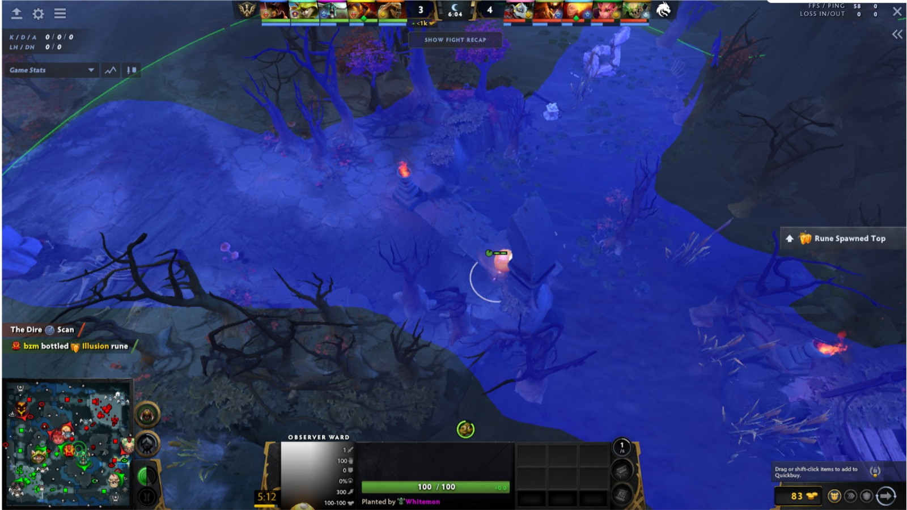

- 观察：覆盖河道符点、两侧坡道与石碑附近路口，便于进攻前控制符区。
- 注意：河道高频排眼；最好在敌方注意力被目标或兵线牵制时布置。

## 第 21 页 — 基地高地入口窄缝眼

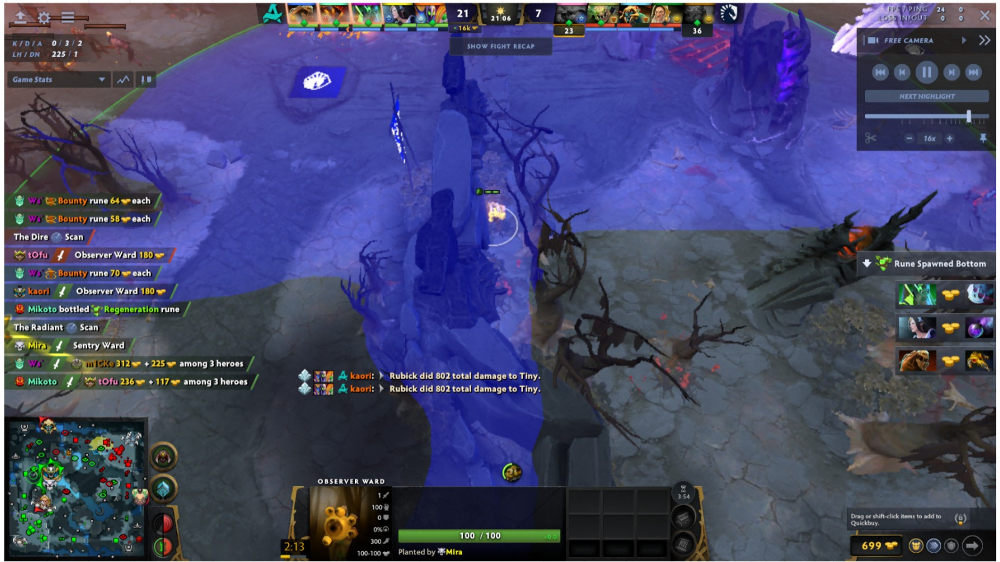

- 观察：沿高地入口形成纵向视野，可看到坡道与基地外侧的活动。
- 注意：中央石柱和右侧地形切断横向视野，适合作为推进辅助眼而非全景眼。

## 第 22 页 — 砍树：智慧神符通道眼

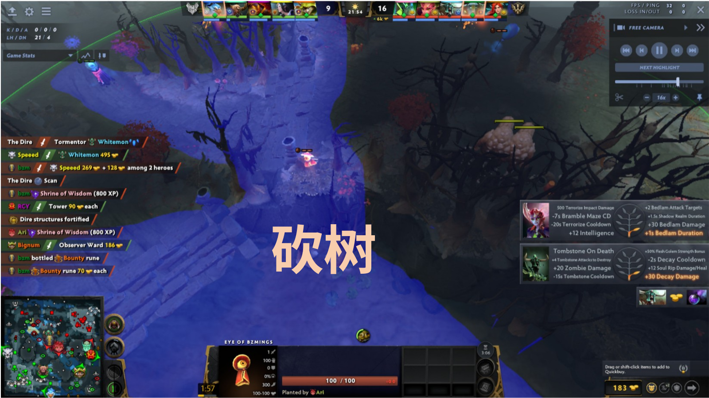

- 原图标注：砍树。
- 观察：画面事件包含智慧神符；砍掉高台边缘树木后，可打通神符区、坡道和野区入口的视野。
- 注意：该区域兼具目标与通行价值，容易被针对性反眼。

## 第 23 页 — 砍树：野区高台眼

- 原图标注：砍树。
- 观察：清理眼位附近树木后，视野连通中立生物区域、坡道和侧向道路。
- 注意：画面中的视野边界仍被剩余树木切割；可按进攻方向选择性砍树。
