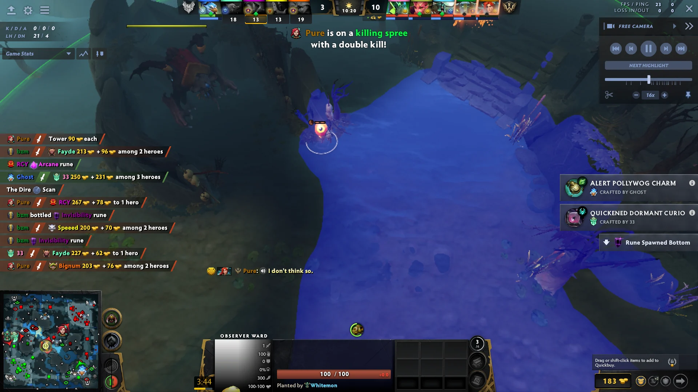
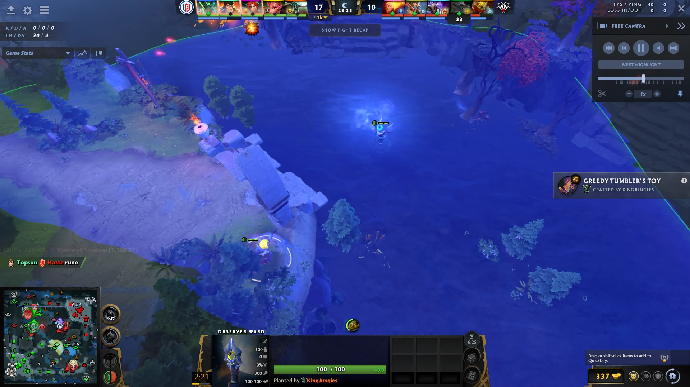

# Video walkthrough notes

These notes follow RoJack's [Best Ward Spots from The International 2026 (Copy These)](https://www.youtube.com/watch?v=59S_PYrXT6c). They condense the narration rather than reproduce it verbatim.

## Normal and hidden placements

| Time | Placement | Why it works |
| -: | - | - |
| [0:08](https://www.youtube.com/watch?v=59S_PYrXT6c&t=8s) | Roshan-pit edge | Whitemon's placement uses irregular pit vision to watch the rune area. RoJack notes that a dewarder must reach the exact spot. |
| [0:24](https://www.youtube.com/watch?v=59S_PYrXT6c&t=24s) | Tree-hidden Dire-base exit ward | Useful when Radiant is constricting Dire's map. The tree hides the observer during routine dewarding unless the opponent already knows the position. |
| [0:44](https://www.youtube.com/watch?v=59S_PYrXT6c&t=44s) | Radiant-triangle cliff edge | Broad triangle vision from the edge of the cliff; an imprecise sentry can leave it just outside detection range. |
| [1:02](https://www.youtube.com/watch?v=59S_PYrXT6c&t=62s) | Alternate Radiant-triangle edge | A simple offset from the standard cliff position that combines useful coverage with a less conventional sentry check. |
| [1:15](https://www.youtube.com/watch?v=59S_PYrXT6c&t=75s) | Behind the trees near Radiant mid Tier 1 | Watches the nearby jungle. It becomes visible only along a narrow walking line through the trees. |
| [1:30](https://www.youtube.com/watch?v=59S_PYrXT6c&t=90s) | Radiant carry-farming river area | Covers the river and part of the adjacent ramp. |
| [1:40](https://www.youtube.com/watch?v=59S_PYrXT6c&t=100s) | Safe bottom-rune vision | A frequently used professional placement that is deliberately difficult to deward. |
| [1:52](https://www.youtube.com/watch?v=59S_PYrXT6c&t=112s) | Dire high-ground approach | Strong post-fight vision into the enemy base. The same location can add valuable night vision when Dire is defending. |
| [2:09](https://www.youtube.com/watch?v=59S_PYrXT6c&t=129s) | Safe-lane camp ledge | Watches the pit-side area and rotations arriving from mid. |
| [2:21](https://www.youtube.com/watch?v=59S_PYrXT6c&t=141s) | Nearby micro-ledge | A small, uncommon ledge that opponents may not include in a standard deward path. |

## Quelling Blade placements

| Time | Placement | Why it works |
| -: | - | - |
| [2:39](https://www.youtube.com/watch?v=59S_PYrXT6c&t=159s) | Rune-side ledge | Cut the blocking tree first. The resulting observer has strong rune vision and is difficult to reach for a deward. |
| [3:17](https://www.youtube.com/watch?v=59S_PYrXT6c&t=197s) | Dire-side counterpart | Uses the same tree-cut principle, but RoJack considers it easier to deward than the Radiant version. |
| [3:24](https://www.youtube.com/watch?v=59S_PYrXT6c&t=204s) | Two edge-tree options | Cutting either edge tree opens river and rune vision. Choose the observer position according to the coverage and expected sentry path. |
| [3:36](https://www.youtube.com/watch?v=59S_PYrXT6c&t=216s) | Less expected alternate tree cut | Sacrifices the most obvious placement for a less predictable observer position. |
| [3:46](https://www.youtube.com/watch?v=59S_PYrXT6c&t=226s) | Carry-rotation scout | Arteezy's example watches a carry's farming rotation and appears to a dewarder only briefly while crossing the ramp. |
| [4:05](https://www.youtube.com/watch?v=59S_PYrXT6c&t=245s) | Roshan-side rotation scout | Watches movement near the pit and its connecting route. |
| [4:15](https://www.youtube.com/watch?v=59S_PYrXT6c&t=255s) | High-ground, sentry-offset spot | Combines high-ground protection with a position outside the most common sentry centers. |
| [4:30](https://www.youtube.com/watch?v=59S_PYrXT6c&t=270s) | White-tree cut | The final example removes the distinctive white tree before placing the observer. |

### Tree-cut mechanic called out in the video

At [2:57](https://www.youtube.com/watch?v=59S_PYrXT6c&t=177s), RoJack explains that a tree cut for an observer does not regrow until the ward expires. The enemy also does not learn that the tree has been removed until they gain vision of that location. This is why a casual Quelling Blade can create valuable support-only warding options.

Return to the [main guide](../README.md).
